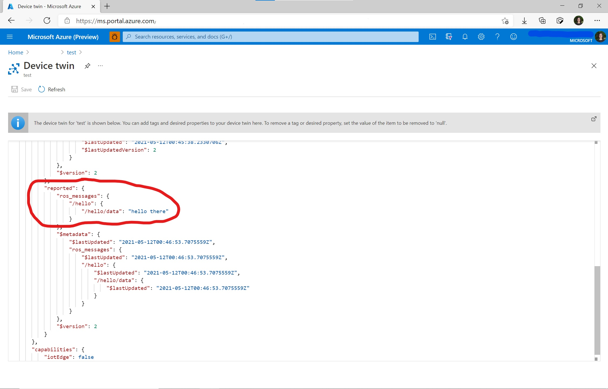

# Azure IoT Hub for ROS

This ROS package works with the Microsoft Azure IoT Hub service to relay telemetry messages from the Robot to Azure IoT Hub or reflect properties from the Digital Twin to the robot using dynamic reconfigure.

# Prerequisites
To use this ROS node on your Robot, you will need:
  * Azure IoT Hub service and at least one device registered under IoT Hub.
    * See more on [Quickstart: Send telemetry from a device to an IoT hub and read the telemetry from the hub with a back-end application](https://docs.microsoft.com/en-us/azure/iot-hub/quickstart-send-telemetry-c).
  * ROS installation.
    * For Windows environment, check [ROS on Windows](https://aka.ms/ros).
    * For Ubuntu Linux environment, check [Ubuntu install of ROS (http://wiki.ros.org/noetic/Installation/Ubuntu).

# How to Build (ROS on Windows)
Here is an example how to build it for ROS on Windows.
```Batchfile
:: source ROS environment
c:\opt\ros\noetic\x64\setup.bat

:: create catkin workspace folders
mkdir catkin_ws\src
pushd catkin_ws

:: checkout required ROS package sources
pushd src
git clone https://github.com/ms-iot/abseil-cpp -b init_windows
git clone https://github.com/facontidavide/ros_type_introspection
git clone -b noetic-devel --recursive https://github.com/Microsoft/ros_azure_iothub
popd

:: install system dependencies
rosdep update
rosdep install --from-paths src --ignore-src -r -y

:: build it and source install environment
catkin_make_isolated --only-pkg-with-deps roscpp_azure_iothub --install
install_isolated\setup.bat
```

# How to Build (Ubuntu Linux install)
Here is an example how to build it for Ubuntu ROS Linux install.

``` bash
# source ROS environment
source /opt/ros/melodic/setup.bash

# create catkin workspace folders
mkdir catkin_ws/src -p
pushd catkin_ws
catkin_init_workspace src

# checkout required ROS package sources
pushd src
git clone --recursive https://github.com/Microsoft/ros_azure_iothub
popd

# install Azure IoT SDK as Debian
sudo add-apt-repository ppa:aziotsdklinux/ppa-azureiot

# update apt to refresh package registries
sudo apt update
sudo apt install -y azure-iot-sdk-c-dev

# install system dependencies
rosdep update
rosdep install --from-paths src --ignore-src -r -y

# build it and source install environment
chmod a+x src/ros_azure_iothub/dynamic_tutorials/cfg/tutorials.cfg
catkin_make install
source /install/setup.bash
```

# Deployment (IoT Hub for telemetry reporting or reported properties channel)
Azure IoT Hub maintains a device twin for each device that you connect to IoT Hub. Device twins are JSON documents that store device state information including metadata, configurations, and conditions.
We are using desired properties as a channel to ask our ROS node what ROS topics to report. The messages received from these ROS topics can either be reported through the telemetry channel or through the reported property channel on the device twin. The telemetry channel is designed for high bandwidth data and the history of messages sent over this channel are stored. The reported property channel is designed for low bandwidth data and it advertises only the latest message for each topic the device twin subscribes to. 

Here is a JSON example to report `/rosout` via telemetry and `/initialpose` via reported properties:

``` json
{
    "deviceId": "devA",
    "properties": {
        "desired": {
            "ros_relays": {
                "1": {
                    "topic": "/rosout",
                    "relay_method": "telemetry"
                },
                "2": {
                    "topic": "/initialpose",
                    "relay_method": "reported"
                }
            }
        }
    }
}
```

Add the `ros_relays` block to the device twin. Use the client side deployment step to connect to your device. You can run the following Azure PowerShell cmdlet to wait for events from IoT Hub.

``` bash
az iot hub monitor-events --hub-name <YourIoTHubName> --output table
```

## Step by step tutorial: Viewing messages through the reported properties channel
### Step 1:
Create a new device twin on the Azure Portal and copy the connection string.

![create device][create_device]
### Step 2:
Populate the device twin with the desired properties tag, adding in the topics you want to subscribe to and the method with which you wish to receive the published messages. In this example, we are subscribing to the /hello topic and we will receive the messages through the reported properties channel.

![desired properties][desired_properties]
### Step 4:
Locally, deploy any ROS nodes you wish. As an example we will be publishing to the topic /hello as the device twin will be subscribing to it.

![publish topic][publish_topic]
### Step 5:
Launch the Azure Iot Hub ROS node and provide the connection string you just copied. 

![launch node][launch_node]
### Step 6:
Back in the Azure portal your device twin should be updated with the latest published messages for each topic it is subscribed to.



# Deployment (IoT Hub for dynamic configuration)
[Dynamic Reconfiguration](http://wiki.ros.org/dynamic_reconfigure) provides a way to change the node parameters during runtime without restarting the node.
Similar as the telemetry reporting, we are using the device twin `desired` properties as a channel to ask our ROS node what dynamic parameters to reconfigure.

* [Dynamic reconfiguration sample](./dynamic_tutorials/)

Here is a JSON example to reconfigure the parameters of `/dynamic_tutorials_node` with the new value:

```json
{
    "deviceId": "devA",
    "properties": {
        "desired": {
            "ros_dynamic_configurations": {
                "0": {
                        "node": "/dynamic_tutorials_node", 
                        "param": "str_param",
                        "type":  "string",
                        "value": "HelloWorld!"
                },
                "1": {
                        "node": "/dynamic_tutorials_node",
                        "param": "int_param",
                        "type":  "int",
                        "value": "33"
                     },
                "2": {
                        "node": "/dynamic_tutorials_node",
                        "param": "double_param",
                        "type":  "double",
                        "value": "0.55"
                     },
                "3": {
                        "node": "/dynamic_tutorials_node",
                        "param": "bool_param",
                        "type":  "bool",
                        "value": "1"
                     }
        }
    }
}
```

Currently 4 types of parameters can be dynamically reconfigured, they are "string", "int", "double" and "bool".

# Deployment (Client side)
This node can be run using `roslaunch` (replacing the value for `connection_string` with the value given by Azure IoT Hub):

``` bash
roslaunch roscpp_azure_iothub sample.launch connection_string:="HostName=sample.azure-devices.net;DeviceId=rosbot;SharedAccessKey=sampleKey"
```

This value can also be set in the ROS Parameter Server at `/roscpp_azure_iothub_node/connection_string`.

Now you can run some other ROS scenarios and see the `/rosout` being reported back to IoT Hub or the node parameters being dynamically reconfigured.

# X.509 Certificate Authentication

By default, the ROS node will use SAS (Shared Access Signatures) to communicate with IoT Hub. Follow the instructions below to use X.509 certificates instead.

First, [set up X.509 security in your Azure IoT hub](https://docs.microsoft.com/en-us/azure/iot-hub/iot-hub-security-x509-get-started#authenticate-your-x509-device-with-the-x509-certificates). Complete the steps until you reach "Authenticate your X.509 device with the X.509 certificates". Instead, the ROS node will be used to connect using the X.509 certificates.

After successfully creating, generating or puchasing the X.509 certificates, you should have a public key/certificate and a private key. If the keys were created for test purposes using these instructions, they  should be stored in two files:`myDevice-private.pem` and `myDevice-public.pem`

Set the DEVICE_PRIVATE_KEY and DEVICE_PUBLIC_KEY environment variables to the full file name for the X.509 keys. For example, on Windows run (replacing 'myCertPath/myDevice' with the path and file name):
```Batchfile
set DEVICE_PRIVATE_KEY="C:/myCertPath/myDevice-private.pem"
set DEVICE_PUBLIC_KEY="C:/myCertPath/myDevice-public.pem"
```

To deploy, run the following. (replacing the value for `connection_string` with the value given by Azure IoT Hub)
```
::Launch the node using the X.509 sample launch file
roslaunch roscpp_azure_iothub sample_x509.launch  connection_string:="HostName=
HostName=sample.azure-devices.net;DeviceId=x509ca-test2;x509=true"
```

# Contributing

This project welcomes contributions and suggestions.  Most contributions require you to agree to a
Contributor License Agreement (CLA) declaring that you have the right to, and actually do, grant us
the rights to use your contribution. For details, visit https://cla.microsoft.com.

When you submit a pull request, a CLA-bot will automatically determine whether you need to provide
a CLA and decorate the PR appropriately (e.g., label, comment). Simply follow the instructions
provided by the bot. You will only need to do this once across all repos using our CLA.

This project has adopted the [Microsoft Open Source Code of Conduct](https://opensource.microsoft.com/codeofconduct/).
For more information see the [Code of Conduct FAQ](https://opensource.microsoft.com/codeofconduct/faq/) or
contact [opencode@microsoft.com](mailto:opencode@microsoft.com) with any additional questions or comments.

<!-- link to files -->
[create_device]: docs/create_device.gif
[desired_properties]: docs/desired_properties.gif
[connection_string]: docs/connection_string.gif
[publish_topic]: docs/publish_topic.gif
[launch_node]: docs/launch_node.gif